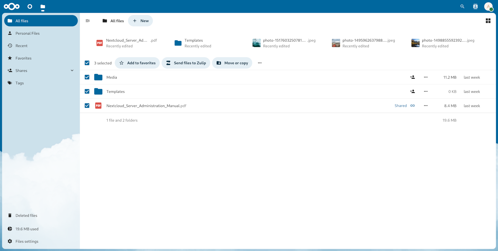
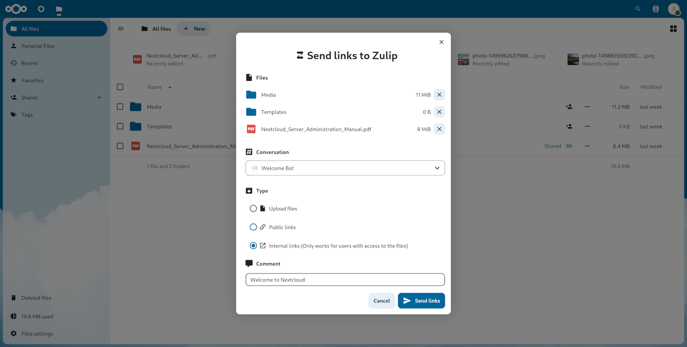

# Zulip integration in Nextcloud

This integration allows you to send Nextcloud files to your Zulip chat instance
as uploaded files, public shared links, or internal shared links.

## 🔧 Configuration

### User settings

Account configuration happens in the "Connected accounts" user settings section.
It requires you to specify the URL of your Zulip instance,
as well as the email address and API key
associated with your Zulip account in that instance.
These values can be found in and copied from your Zulip account's `zuliprc` file
located in **Personal settings > Account & privacy > API key**.

If those settings are not configured,
a link to the "Connected accounts" user settings page will be displayed
when attempting to send a file to a Zulip user/topic.
The context menu to send a file can be accessed
by right clicking on the file/folder to be shared
or selecting them and clicking on the "Actions" button.

## 🖼️ Screenshots

